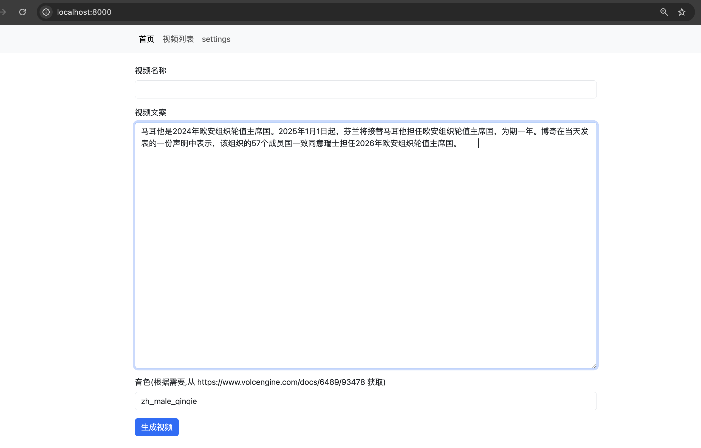
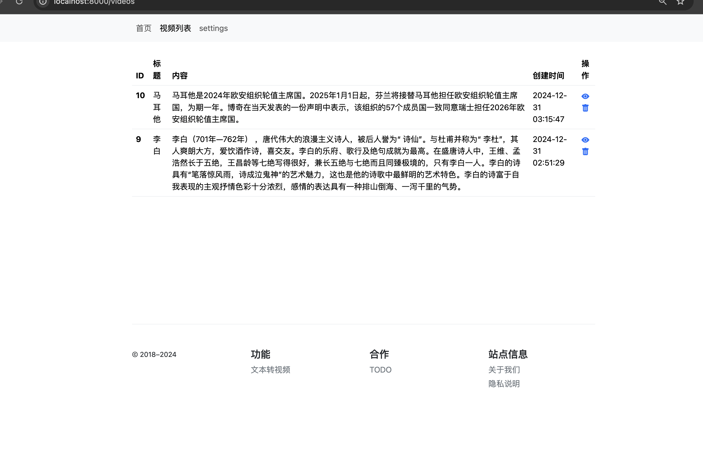
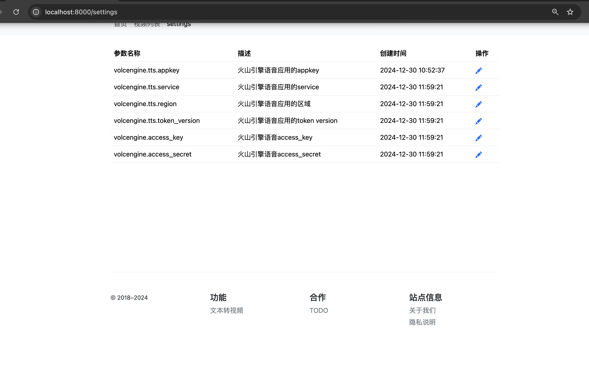

Text to Video(文本生成图片)
================================

基于文本，基于百度搜索,自动配图; 基于[火山引擎](https://www.volcengine.com/docs/6489/71999#php)自动配音;

适用于: 

> 知识科普,时事新闻等短视频的生成


## 效果展示

如根据:

```
马耳他是2024年欧安组织轮值主席国。2025年1月1日起，芬兰将接替马耳他担任欧安组织轮值主席国，为期一年。博奇在当天发表的一份声明中表示，该组织的57个成员国一致同意瑞士担任2026年欧安组织轮值主席国。
```

生成视频(如不能展示，可下载:`demo/4ae53065f7704ee8aa79c53448e21de8.mp4`):


### 图片效果







## 配置使用

### 源码部署

1.	本地安装[poetry](https://poetry.pythonlang.cn/docs/)
2. 本地安装好ffmpeg
3. 	git clone 本项目
4. 	进入项目后，执行: 

> poetry shell


> poetry install

> ./run.py

浏览器访问:   http://localhost:8000/

### docker部署[推荐]
1. git clone本项目
2. 进入项目目录,执行:

>  docker build -t text-to-video:demo  .

> docker run -p 8000:8000  -it  text-to-video:demo


浏览器访问:   http://localhost:8000/


## 技术思路
1. 将用户输入的段落，切分成短句
2. 针对每个短句，使用selenium(避免IP被封)，爬取一张百度图片；然后调用字节火山引擎接口，生成音频，合成一个VideoClip
3. 把所有短句的VideoClip，合成一个Video
4. 数据使用sqlite存储，方便单机迁移和部署


## 技术支持
微信扫描二维码，备注: `github`


